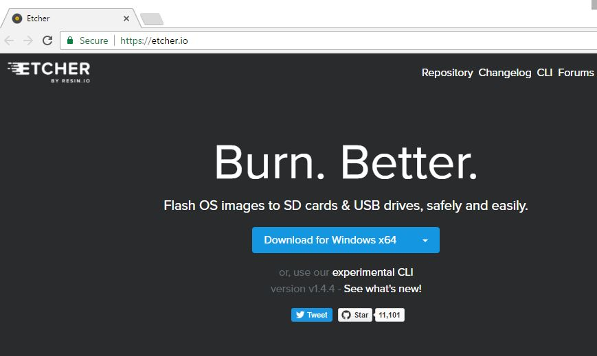
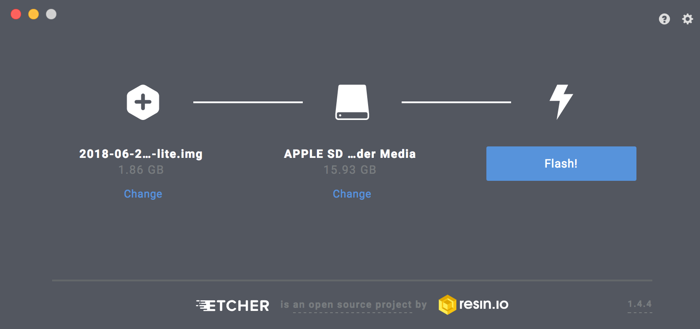
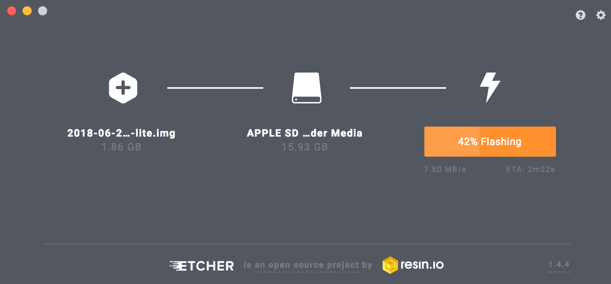

# Programming Assignment Zero (First Draft)

##### CSCI 2753: Operating Systems, 2018

## Introduction:

This assignment will guide you through the setup of the Pi3 that will be used in class. The goal of this assignment is to get your Pi3 ready for programming assignment one.

You will need the following materials:

1. Raspberry Pi 3
2. A 8 GB (or 16 GB) micro SD card
3. A micro SD to SD adapter (or micro SD to USB adapter)
4. A computer that has a SD card reader or a USB to SD card reader adapter

## Step 1: Download image from Raspberry Pi Website

We will be using a command line only version of Linux called Raspian Lite. Download the file from [Raspian Lite](https://www.raspberrypi.org/downloads/raspbian/).  This is 367 MB for the 2018-06-27 release.

Extract the image file (\*.img) if you downloaded the zipped file.  We are now ready to install the operating system on the SD card.

Raspbian is the Raspberry Pi Foundation’s official supported operating system. You can download the image below and follow their [installation guide]( https://www.raspberrypi.org/documentation/installation/installing-images/README.md) or you can follow our step by step instructions listed below.

## Step 2: Writing image to SD card

> **NOTE:** Make sure you don't have any important data on your SD card. After this process the SD will be wiped.

We will cover two ways to write the image to a SD card. One method is to use Etcher, a tool that allows you to flash OS images to SD cards. Etcher works on Windows, MacOS, and Linux. The other is a more advance way using the command line (CLI) on a MacOS or Linux  system. First we will cover Etcher, then the more advanced `dd` command.

## Step 2a: Using Etcher (Easy method)

First you need to download Etcher. You can do this by clicking [here](https://etcher.io/) and this will take you to the website, shown below:



Click Download. Navigate to the `Download` directory and double click `Etcher-Setup-1.4.4-x64.exe` and follow installation instructions.

Once installed you can run Etcher.  Now insert the SD card into your computer. It will show up in Etcher.  Select the image you just downloaded (using 2018-06-27-raspbian-stretch-lite.img in the example).  



Flash the drive (press the Flash button).  This may take a while to complete.  You will see the progress reported in the button.



Once the process is complete, you can exit the Etcher application.

## Step 2b: Using `?????` command (Advanced method, MacOS only)

> **NOTE: You can skip this step if you completed *Step 2: Using Etcher (Easy method)*** .

To use the `dd` command you will have to be on Linux and have root privileges. There are well written instructions on the pi website [here](https://www.raspberrypi.org/documentation/installation/installing-images/linux.md) or you can use the instructions below.  The SD card shows up as a devices rdisk2 and rdisk2s1.

```text
someones-MacBook-Pro:~ David$ ls /dev | grep rdisk
rdisk0
rdisk0s1
rdisk0s2
rdisk0s3
rdisk1
someones-MacBook-Pro:~ David$ echo placed the SD card into machine
placed the SD card into machine
someones-MacBook-Pro:~ David$ ls /dev | grep rdisk
rdisk0
rdisk0s1
rdisk0s2
rdisk0s3
rdisk1
rdisk2
rdisk2s1
```
After the 16 GB micro SD card is mounted we can see the disk devices using `diskutil` on a Mac. Use the `lsblk` command to list the block devices in Linux.


```text
someones-MacBook-Pro:~ David$ diskutil list
/dev/disk0 (internal, physical):
   #:                       TYPE NAME                    SIZE       IDENTIFIER
   0:      GUID_partition_scheme                        *500.3 GB   disk0
   1:                        EFI EFI                     209.7 MB   disk0s1
   2:          Apple_CoreStorage Macintosh HD            499.4 GB   disk0s2
   3:                 Apple_Boot Recovery HD             650.0 MB   disk0s3

/dev/disk1 (internal, virtual):
   #:                       TYPE NAME                    SIZE       IDENTIFIER
   0:                  Apple_HFS Macintosh HD           +499.0 GB   disk1
                                 Logical Volume on disk0s2
                                 21447694-4EF6-4C4E-9874-9ED5CBDEDA19
                                 Unencrypted

/dev/disk2 (internal, physical):
   #:                       TYPE NAME                    SIZE       IDENTIFIER
   0:     FDisk_partition_scheme                        *15.9 GB    disk2
   1:             Windows_FAT_32 NO NAME                 15.9 GB    disk2s1
```

> **WARNING:** The `dd` command is very powerful and if used inappropriately is able to wipe all the data from your hard drive. Make sure to read the instructions carefully. Also note, displayed information may vary depending on your system setup.

<!--
After inserting the SD card into the computer, use the `lsblk` command to list the block devices in Linux.
Here is an example on a Linux machine:
```bash
$ lsblk
NAME        MAJ:MIN RM   SIZE RO TYPE MOUNTPOINT
sda           8:0    0 119.2G  0 disk
├─sda1        8:1    0   512M  0 part /boot/efi
└─sda2        8:2    0 118.8G  0 part /
mmcblk0     179:0    0  14.9G  0 disk
├─mmcblk0p1 179:1    0  43.1M  0 part /media/my_sd_card/boot
└─mmcblk0p2 179:2    0   1.7G  0 part /media/my_sd_card/rootfs
```


If the SD card is partitioned, Linux will mount them automatically. Before writing the new image unmount the partitions with the following commands:
```bash
$ sudo umount /media/my_sd_card/boot
$ sudo umount /media/my_sd_card/rootfs
```
Run the `lsblk` command again. The `MOUNTPOINT` fields will be empty.

```bash
$ lsblk
NAME        MAJ:MIN RM   SIZE RO TYPE MOUNTPOINT
sda           8:0    0 119.2G  0 disk
├─sda1        8:1    0   512M  0 part /boot/efi
└─sda2        8:2    0 118.8G  0 part /
mmcblk0     179:0    0  14.9G  0 disk
├─mmcblk0p1 179:1    0  43.1M  0 part
└─mmcblk0p2 179:2    0  14.8G  0 part
```
Now write the image to the SD card. It is very important that you **DON'T** specify a partition (`mmcblk0p1` or `mmcblk0p2`). You write the image to the device (`mmcblk0`) as shown below.

```bash
$ sudo dd of=/dev/mmcblk0 if=2018-04-18-raspbian-stretch-lite.img bs=4M conv=fsync
```
-->
## Step 3: Before you plug your SD card into Pi

Before moving the micro SD card to the Raspberry Pi 3, we need to perform a couple of more steps to enable access over network.

<!--
### Step 3.1: Enabling local networking

Much of the following information is taken from [Nic Raboy's]( https://www.thepolyglotdeveloper.com/2016/06/connect-raspberry-pi-zero-usb-cable-ssh/) description for a Raspberry Pi Zero.  The Pi Zero does not have enough processing power or memory for use in this course.

For more information about ethernet of USB, visit: http://www.linux-usb.org/usbnet/

#### Configuring to Emulate Ethernet Over USB
The long term goal is to use SSH over USB. This means we have to configure Raspbian to treat the USB port like an ethernet port. Mount the micro SD card in a computer (not Raspberry Pi) and open it with Finder, or Windows Explorer, or whatever it is that you use.

There are multiple partitions on the device, but we are interested in the `boot` directory that is accessible from most any machine.  Within this directory we will open the file `confix.txt` for editing.  In this file you want to add the following line at the very bottom:
```text
dtoverlay=dwc2
```

The above line will set us up for the next file that we alter. The next file we alter is `cmdline.txt`, but it is a bit different. Parameters in this file are not delimited by new lines or commas, they are delimited by space characters. In this file we want to add the following:
```text
modules-load=dwc2,g_ether
```
The above parameter should be added after the `rootwait` parameter. Yes the above parameter is a single parameter, meaning don’t add a bunch of space characters within it. More information on networking over USB on Linux can be found [here](http://www.linux-usb.org/usbnet/).
-->

### Step 3.1: Enabling Remote Access

> **NOTE:** This step can be skipped if you ONLY use a direct connection to your Pi or ONLY use your Pi with a monitor and keyboard.  If you want to access the Pi remotely, you will need to perform this step.

The Raspberry Pi Foundation is disabling SSH (Secure SHell) by default in Raspbian as a security precaution. More information on the subject can be found [here](https://www.raspberrypi.org/blog/a-security-update-for-raspbian-pixel/).
To enable SSH, we will be adding a file called `ssh`  to the `boot` partition on the SD card.  The file can be blank, and it has no extensions. It should exist at the same location as the other files that were edited above.  The boot directory is read during the booting of the Pi and if a file named `ssh` is found in the directory, then SSH is enabled at boot time.  This is useful if we don't have a monitor to login and enable SSH manually after each boot of the Pi.

In the following example, all remote file systems are mounted in the `/Volumes` directory and the device name is `my_sd_card`.  The `touch` command will change the data/time of the last modification of the given file.  If the file does not exist, `touch` will create it.

```text
cd /Volumes/my_sd_card/boot
touch ssh
```

## Step 4: Installing the micro SD card
At this point the micro SD can be inserted into the Raspberry Pi. Make sure the power is disconnected from the Raspberry Pi before continuing.  If there is already a card in the computer, remove it. Now insert the micro SD card into the slot provided. The card will only work if installed in the correct orientation. The connection pins on the card should go in first and against the board.
The micro SD card should click into place when correctly inserted.

Now you can now connect the power back to the Raspberry Pi and you can watch the lights to see if the green lights are flashing to indicate it is booting.  Once the operating system is running, the lights should remain constant.

If you have a display attached, you should see the boot messages printed on the screen.  


## Step 5: Connecting your Raspberry Pi to the network
The easiest method for communicating with the Pi is using the ethernet connection.  If you have a power supply, you can connect your Pi's ethernet to your local or WiFi router.  This will allow you to access your Pi from any device connected to the wireless.  If you have a static IP address you will be able to access the Pi from remote locations by knowing its IP address.

A simpler and more secure way to access it is to connect the ethernet from Pi to the laptop.  If your laptop has an ethernet connector you can just plug it in.  If you only have USB connections, I suggest you invest in a USB to internet device.  (See [USB 3.0 hub](https://www.amazon.com/CableCreation-Ethernet-Aluminum-Durable-Braided/dp/B01FJQGB0M) )


## Step 6: Remotely access your Raspberry Pi

<!-- show the steps for ssh-ing to the rpi-->

Use `ping` command to see if the raspberry pi is connected.  The default hostname is `raspberrypi` and we only want to access it on the local network.
```text
someones-MacBook-Pro:~ David$ ping raspberrypi.local
PING raspberrypi.local (169.254.224.216): 56 data bytes
Request timeout for icmp_seq 0
64 bytes from 169.254.224.216: icmp_seq=1 ttl=64 time=0.385 ms
64 bytes from 169.254.224.216: icmp_seq=2 ttl=64 time=0.386 ms
```
If the Pi is available, you will see successfull transfer of bytes with the number of milliseconds (ms) it took to transfer.

Let's try to remotely connect to the Raspberry Pi using SSH by logging in as user `pi`.  
```text
someones-MacBook-Pro:~ David$ ssh pi@raspberrypi.local
```

You may encounter a problem with security if you have connected to a different Raspberry Pi before.  This may also occur when you change local networks.  You may see a message like the following:
```text
@@@@@@@@@@@@@@@@@@@@@@@@@@@@@@@@@@@@@@@@@@@@@@@@@@@@@@@@@@@
@       WARNING: POSSIBLE DNS SPOOFING DETECTED!          @
@@@@@@@@@@@@@@@@@@@@@@@@@@@@@@@@@@@@@@@@@@@@@@@@@@@@@@@@@@@
The ECDSA host key for raspberrypi.local has changed,
and the key for the corresponding IP address fe80::8a0a:acb6:98e4:ac33%en5
is unknown. This could either mean that
DNS SPOOFING is happening or the IP address for the host
and its host key have changed at the same time.
@@@@@@@@@@@@@@@@@@@@@@@@@@@@@@@@@@@@@@@@@@@@@@@@@@@@@@@@@@@
@    WARNING: REMOTE HOST IDENTIFICATION HAS CHANGED!     @
@@@@@@@@@@@@@@@@@@@@@@@@@@@@@@@@@@@@@@@@@@@@@@@@@@@@@@@@@@@
IT IS POSSIBLE THAT SOMEONE IS DOING SOMETHING NASTY!
Someone could be eavesdropping on you right now (man-in-the-middle attack)!
It is also possible that a host key has just been changed.
The fingerprint for the ECDSA key sent by the remote host is
SHA256:rwYWWIq3DgExn55WRmU1dZ5jxUbVG3tQNGv3UwNB4+Q.
Please contact your system administrator.
Add correct host key in /Users/David/.ssh/known_hosts to get rid of this message.
Offending ECDSA key in /Users/David/.ssh/known_hosts:7
ECDSA host key for raspberrypi.local has changed and you have requested strict checking.
Host key verification failed.
```

You can easily fix this error by editing the `/Users/David/.ssh/known_hosts` file and removing the entry for `raspberrypi` from the known hosts.

Repeat the SSH command and you should receive the message below.  You must type `yes` at the prompt, `y` will not work.

```text
someones-MacBook-Pro:~ David$ ssh pi@raspberrypi.local
The authenticity of host 'raspberrypi.local (fe80::8a0a:acb6:98e4:ac33%en5)' can't be established.
ECDSA key fingerprint is SHA256:rwYWWIq3DgExn55WRmU1dZ5jxUbVG3tQNGv3UwNB4+Q.
Are you sure you want to continue connecting (yes/no)? yes
```
Type `yes` and press return to continue.  The new connection is recorded and the Raspberry Pi is now asking for the password associated with the user `pi` that was specified in the SSH command.   The default password for the user is `raspberry`.

```text
Warning: Permanently added 'raspberrypi.local,fe80::8a0a:acb6:98e4:ac33%en5' (ECDSA) to the list of known hosts.
pi@raspberrypi.local's password:
```
Enter `raspberry` and the system will allow you to login.

```text
Linux raspberrypi 4.14.50-v7+ #1122 SMP Tue Jun 19 12:26:26 BST 2018 armv7l

The programs included with the Debian GNU/Linux system are free software;
the exact distribution terms for each program are described in the
individual files in /usr/share/doc/*/copyright.

Debian GNU/Linux comes with ABSOLUTELY NO WARRANTY, to the extent
permitted by applicable law.

SSH is enabled and the default password for the 'pi' user has not been changed.
This is a security risk - please login as the 'pi' user and type 'passwd' to set a new password.

pi@raspberrypi:~ $
```

*** The only problem is that we cannot talk to the rest of the world.  We cannot download the other items needed ***
???? HOW DO WE ROUTE REQUESTS THRU A LOCAL ?????


## Step 6a: Setting up WiFi (optional)

--- show the steps for setting up local WIFI and remote WiFi


## Step 7: Download Source code and Tools for Linux

### 7.1 Download Tools

Now let's install necessary programs.

```text
sudo apt install git vim libncurses5-dev make gcc ccache
```

### 7.2 Download Source

Now we will download kernel source code.

```text
cd ~
git clone --depth 1 https://github.com/raspberrypi/linux.git
```

To use the same configuration as our current kernel we need to enable configs module.

```text
sudo modprobe configs
```

Make sure to `cd` into top level of the kernel source directory.

```text
cd ~/linux
```

Next we copy the current running kernel config file to our kernel source directory.  We uncompress the virtual file containing the current configuration using `zcat` and place the file into `.config` in the `~/linux` directory.  This configuration file specifies the options for building a kernel. We want to build one exactly like the one currently running, except we will add our own system call.

```text
zcat /proc/config.gz > .config
```
> Note: If you get an error that config.gz was not found, make sure configs module is loaded

To edit .config file using a menu run:
```text
make menuconfig
```
Once the character based menuing is displayed, scroll down to select:
```text
General setup --->
```
In the general setup menu, we want to select the name of our kernel version.  It is currently set to `-v7`, which is appended to the kernel file when we build it.  Scroll down to the local version and select it.
```text
(-v7) Local version - append to kernel release
```
Replace `-v7` with your name. Tab to the top directory and select `<Save>` and save it to the .config file (default).  Use left arrow to select the `Exit` from the general setup menu and left arrow again to select `Exit` from the `menuconfig` application.

### 7.3 Compile the Kernel

```text
make -j4 CC="ccache gcc" modules dtbs zImage
```

This will take about two and a half hours the first time.  We are using the ccache utility to make subsequent compiles much faster.

```text
sudo make modules_install
```
Make sure to replace `<kernel_name>` with any name except the default's kernel name (i.e. `kernel7`).
```text
sudo cp arch/arm/boot/dts/*.dtb /boot/
sudo cp arch/arm/boot/dts/overlays/*.dtb* /boot/overlays/
sudo cp arch/arm/boot/dts/overlays/README /boot/overlays/
sudo cp arch/arm/boot/zImage /boot/<kernel_name>.img
```

Replace `<kernel_name>` with any name you like.  Make sure **NOT** to name it `kenrel7` since this is the default kernel name already installed on your system. If you do so and your platform doesn't boot, you will have to start the assignment from the beginning!  (See 1.7)

### 7.4 Telling the boot process to use your kernel
When the system is booting, it gets the name of the kernel from the `config.txt` file that is located in the `boot` partition.  To specify that you want to load your new kernel, you must edit the `config.txt` file and add a line:
```
kernel=<kernel_name>.img
```
where <kernel_name> is the name you used in the `cp` command above to copy the kernel into the boot partition.

### 7.5 Rebooting to your newly built Kernel
```text
 sudo reboot
```
You are now booting and running your newly built kernel.

### 7.6 What if your new kernel does not run?

If your kernel boots, but does not behave correctly, you can edit the `<device>/boot/.config` file and remove (or comment out) the `kernel=<kernel_name>.img` line, which will then default back to the original kernel.  Save the file and reboot.  You should be back to where you were before step 7.4 was performed.

To recover from a bad kernel (one that will not boot) you need a second system to access the files on the SD card.  Turn OFF the power to your platform and remove the micro SD card.
You will need to mount this device in another computer via an SD card reader or or USB converter. Once you have mounted the device, you can look in its boot partition.
```
ls <device>/boot
```
You can edit the `<device>/boot/.config` file and remove (or comment out) the `kernel=<kernel_name>.img` line, which will then default back to the original kernel.  Save the file back to the SD card, unmount the device, and place it back into platform. Turn the power back ON and your platform will boot the previously working kernel.
